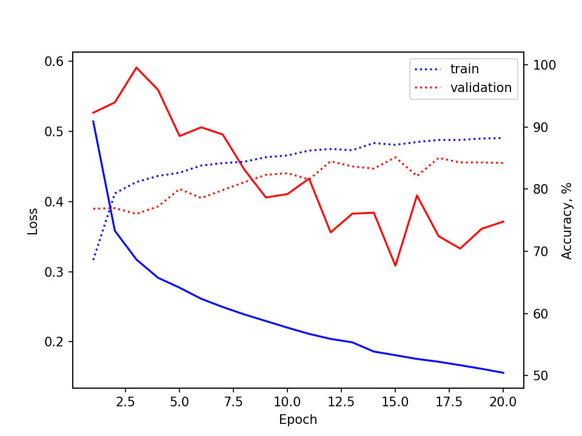

# Бинарный классификатор голосов

 *Tестовое задание для проекта Interactive Speaker Recognition*

**Задание**: Классификатор мужских и женских голосов на базе [LibriTTS](https://arxiv.org/abs/1904.02882)

## Краткое описание репозитория

Все исполняемые файлы находятся в корне, перед запуском `decision_tree.py`, `svm.py` и `train_fc.py` необходимо выполнить предобработку звуковых файлов -- сохранить спектры их Фурье-разложений -- для чего следует запустить `ft_export.py`. Предварительно датасет LibriTTS (а именно файл `SPEAKERS.txt` и папку с какой-либо частью датасета, например `dev-clean`) нужно сохранить в директорию `data/LibriTTS`.

Полный список использованных библиотек находится в `requirements.txt`. Наиболее важные из них:
* `numpy-1.23.1`
* `pytorch-1.12.1` + `torchaudio-0.12.1` + `torchvision-0.13.1`
* `scikit-learn-1.1.2`
* `scipy-1.9.1`
* `matplotlib-3.5.2`
* `pandas-1.4.4`

## Чтение и предобработка данных

Работа с датасетом `LibriTTS` осуществляется с помощью одноименного класса, реализованного в фреймворке *PyTorch*.
Рассматриваемая задача существенно проще чем та, для которой был создан `LibriTTS`, поэтому в качестве датасета можно использовать только его часть.
Я выбрал `dev-clean`, включающий в себя 9 часов речи 20 мужчин и 20 женщин -- этого оказалось вполне достаточно. Эта часть датасета была разделена на 3 выборки -- тренировочную, тестовую и валидационную -- в соотношении 60:20:20. Деление производилось по дикторам -- каждый попадал только в 1 выборку.

Предыдущего опыта работы со звуком у меня нет, курс по цифровой обработке сигналов
начался в этом семестре. Из той информации, что у меня есть, самым разумным
способом классифицировать звуковые файлы мне показался анализ спектров их 
Фурье-разложения. В *PyTorch* (точнее в `torchaudio`) для этого есть удобная
функция `spectrogram`, выполняющая оконное преобразование Фурье (STFT). На первом этапе мне хотелось поработать даже не с таким (двухмерным) представлением сигнала,
а с обычным дискретным преобразованием Фурье, но с постоянным числом частот.
Для этого я решил просто усреднять полученный с помощью STFT сигнал во времени.
На графике ниже показано сравнение такого усреднённого STFT с ДПФ, полученным
с помощью `scipy.fft.fft`.

Видно, что основные признаки амплитудного спектра сохранаются. Не сомневаюсь, что
существуют более разумные методы решения такой проблемы, но для рассматриваемой
задачи такой подход мне показался приемлемым.

Чтобы не тратить много времени на STFT я решил сохранить эти спектры в отдельную
директорию `data/arrays`, благо много места они не занимают. Выполнить это можно
с помощью скрипта `ft_export.py`.

## Решение задачи классификации

Сначала я решил проверить, нет ли заметного сдвига между амплитудами Фурье-спектров
мужчин и женщин. Для этого я рассчитал среднюю частоту для каждой аудиозаписи
из `train` (обучающей) и `dev` (валидационной) выборок. Результат приведён ниже.

Видно, что различие между средними частотам голосов мужчин и женщин не является
статистически значимым. Проще говоря, сделать простой классификатор на основе
сравнения средней частоты с каким-то базовым уровнем не получится.

Следующим шагом стала классификация Фурье-спектров с помощью ненейросетевых
методов машинного обучения, реализованных в библиотеке *Scikit-Learn*.
Мой (не самый богатый) опыт говорит о том, что для решения поставленной
задачи -- бинарной классификации векторов размерности порядка $10^2$ --
неплохо подходят решающие деревья и SVM. Код для их обучения приведён в файлах
`decision_tree.py` и `svm.py`. После небольшой оптимизации гиперпараметров
мне удалось получить следующие результаты на валидационной выборке:
* решающее дерево -- точность 93%
* SVM -- точность 95% 

Далее я попробовал обучить на этих же данных простую нейросетевую модель с одним
скрытым слоем и ReLU-активацией. График обучения приведён ниже. Полученная точность
заметно ниже, чем у рассмотренных выше моделей. Кроме того, она оказывается
сравнимой или ниже даже на обучающей выборке, что свидетельствует о том, что
такая модель является недостаточно сложной.

Других экспериментов с полносвязными моделями я не проводил. Вместо этого я перешел
к свёрточным нейронным сетям, при этом в качестве входных данных использовалось
STFT. Размерность входных данных -- `(1, 224, 224)`, обрезание или паддинг
выполнялись только по оси времени. В качестве архитектуры была выбрана *VGG11*
из библиотеки *torchvision*, т.е. одна из самых простых классификационных CNN.
Точность на валидационной выборке составила 99%, график обучения приведён ниже.

Отчасти выбор готовой модели был мотивирован возможностью использования
предобученных весов. Обычно такой подход является разумным, даже если входные
данные существенно отличаются от фотографий из ImageNet (или каких-либо других
используемых для предобучения данных), т.к. выделяемые сверточными слоями
признаки могут присутствовать на изображениях абсолютно разной природы. Особенно
это актуально для первых свёрточных слоев, которые выполняют функции схожие
с фильтрами Габора. Однако в данном случае никакого преимущества предобученные
веса не дали, приведённый график соответствует случайным начальным весам.

Далее все обученные модели были проверены на тестовом датасете. Результаты:

| Model       | Accuracy |
|-------------|----------|
|Decision tree|  75.3%   |
|SVM          |  62.6%   |
|Fully connected NN|  75.3%   |
|Convolutional NN  |  82.0%   |

К сожалению, точность классификации заметно уменьшилась. Я предполагаю, что
это могло случиться из-за коррелированности обучающей и валидационной выборки.
Напомню, что изначально в использованном датасете (`LibriTTS/dev-clean`)
имеются 40 различных дикторов, по 20 каждого пола. Далее я произвольно разделил
каждую группу из 20 на 3 группы в соотношении 12:4:4. Можно предположить, что
в таком случае валидационная и тестовая выборка, состоящие из 4 представителей
каждого пола могли оказаться недостаточно разнообразными. Действительно, если
в валидационной выборке присутствует хотя бы 1 человек с голосом, похожим
на какого-либо диктора из обучающей выборки, то модель могла переобучиться.

Если проблема заключается именно в этом, то её решением может быть другой подход
к сбору датасета. Так, можно взять большую часть *LibriTTS*, но при этом
оставить большое число дикторов и сокращать размер датасета за счёт выбора
лишь части аудиозаписей каждого диктора.

На такую работу у меня уже не хватает времени, поэтому я решил ещё раз выполнить
обучение моделей, но с небольшими поправками:
* другое разделение дикторов по датасетом, в частности, более равномерное
  по общему числу аудиозаписей,
* во всех моделях увеличена регуляризация.

Результаты:
| Model            | Validation Accuracy | Test accuracy |
|------------------|---------------------|---------------|
|Decision tree     |        90.9%        |     80.4%     |
|SVM               |        87.6%        |     79.9%     |
|Fully connected NN|        85.1%        |     76.1%     |
|Convolutional NN  |        94.9%        |     93.5%     |

Новые графики обучения нейросетевых моделей

